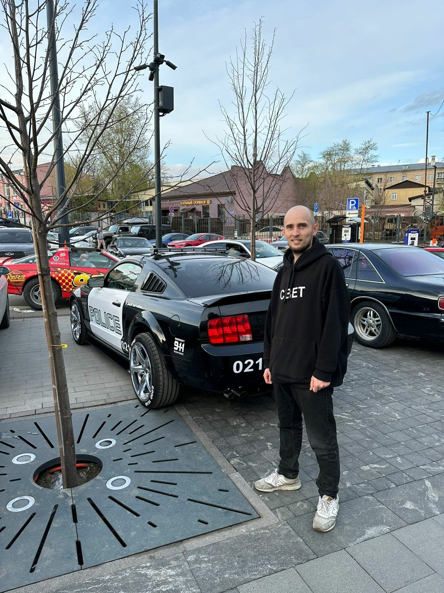

Я есть и буду, на отложенном для меня пути.

Познаю и изучаю, порою мимо проходя

Что найду на тех полях, бескрайних

В тех, где не было меня

Я обрету друзей 

И широту взора своего

Никого не позабуду 

Спасибо за урок!